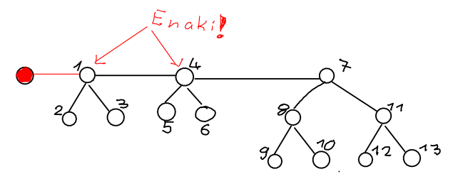
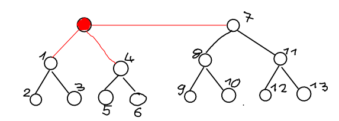
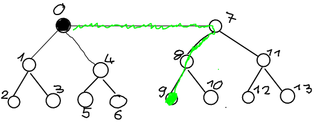

# Naloge v sedmem tednu

V sedmem tednu se bomo ukvarjali s polimorfizmom, implementirali pa bomo še podatkovno strukturo, ki smo jo spoznali v prejšnjem tednu.

## Naloga 1.

Implementirajte razred, ki bo predstavljal poljubno algebrsko strukturo z eno binarno operacijo.
```scala
case class AlgebraStruct[A](s :List[A], op: (A, A) => A)
```
Kot argument tega razreda je torej (končna) množica nad katero je struktura definirana in pa binarna operacija nad to množico.

Preverjali bomo štiri osnovne lastnosi:
  1. Notranjost (zaprtost) operacije op - vse pare elementov iz s preslika v en element, ki je še vedno v s.
  2. Asociativnost
  3. Enota - element e iz množice s je enota, če velja op(e,x) = op(x,e) = x in to za vsak x iz s.
  4. Obrnljivost - element x je obrnljiv, če obstaja y, da velja xy = yx = e (enota).
  5. Komutativnost

Več podrobnosti si lahko ogledate še na:
http://www.fmf.uni-lj.si/~skreko/Pouk/ds2/Predavanja/2007-08/OsnoveAlgebre_2008.pdf

Zato implementirajte metode:
```scala
def isClosed: Boolean
```
Ta metoda preveri, če je operacija op notranja za množico s.

```scala
def isAssoc: Boolean
```
Ta metoda preveri, če je operacija op asociativna.

```scala
def hasUnit:Boolean
```

```scala
def hasInverse(e:A):Boolean
```

```scala
def isCommut: Boolean
```

Z zgornjimi operacijami pa lahko definirate sledeče vrednosti:
```scala
val isGrupoid: Boolean
val isSemigroup: Boolean
val isMonoid: Boolean
val isGroup: Boolean
val isAbelianGroup: Boolean
```

Kdaj je struktura grupoid, polgrupa, monoid, grupa in Abelova grupa, si lahko pogledate na prej omenjeni povezavi.

## Naloga 2.
Nekatere strukture, ki jih boste definirali, ne bodo niti grupoidi, ker ne bodo imeli notranje operacije op. Implementirajte metodo:
```scala
def makeGrupoid: AlgebraStruct[A]
```
ki bo zaprla operacijo op. Bodite previdni pri preizkušanju te funkcije, ker vam jo z lahkoto odnese v neskončnost :repeat:.

## Naloga 3.:crown:
V predhodni nalogi ste za predstavitev labirinta uporabili linearni seznam, za katerega pa veste, da dostop da poljubnega elementa traja *O(n)* časa.

 Obstaja pa elegantna podatkovna struktura, ki se imenuje seznam z naključnim dostopom. Ta struktura še vedno omogoča učinkovito nespremenljivost, hiter dostop do glave in repa seznama, poleg tega pa omogoča tudi hiter dostop do poljubnega elementa v seznamu (*O(log(n))*).

### Globalen pogled na to strukturo
Struktura je implementirana kot seznam polnih dvojiških dreves, ki so urejena po velikosti, od najmanjšega do največjega, pri čemer sta lahko samo prvo in drugo drevo iste velikost, ostali so striktno različni.

Primer take strukture je podan na spodnji sliki.


Elementi so v seznamu v zaporedju kot so urejene oznake po abecedi.

### Dodajanje na začetek seznam
Element dodamo na začetek seznama tako, da preprosto ustvarimo drevo z enim elementom, ki ga pripnemo na začetek seznama dreves. Potem preverimo, če imata naslednji dve drevesi (imenujmo ju T1 in T2) enako velikost. Če je temu tako, potem ju združimo v novo drevo, kjer za koren postavimo ravnokar vstavljeni element, levo poddrevo je drevo T1, desno poddrevo pa je drevo T2.

Spodnja slika prikazuje primer situacije po vstavljanju elementa v glavo, ko detektiramo, da sta drugo in tretje poddrevo enake velikosti, česar pa ne dovolimo.


Zato združimo vstavljeni element in drugo ter tretje drevo, da nastane sledeče zaporedje dreves:



## Iskanje elementa s podanim indeksom

Ideja za dostop do elementa s podanim indeksom je seveda rekurzivna:
  1. Če iščem indeks 0, potem vrnem kar trenutni element
  2. Če je indeks (i) večji ali enak kot je število vozlišč v trenutnem drevesu (n), potem vrnem element z indeksom i-n iz naslednjega drevesa.
  3. Če je indeks (i) manjši kot je število elementov (n_l) v levem poddrevesu, potem vrnem element z indeksom i-1 iz levega poddrevesa, sicer pa element z indeksom in_l-1 z desnega poddrevesa.

Spodnja slika prikazuje pot do elementa z indeksom 9.



### Spreminjanje elementa s podanim indeksom
V tej strukturi lahko učinkovito implementiramo tudi spreminjanje elementa. Samo spreminjanje je zelo podobno iskanju elementa s podanim indeksom, zato vam to prepuščamo za nalogo.


### Implementacija

Implementirajte metode v traitu RList:

```scala
trait RList[+A] {
  def add[AA >: A](e: BB): RList[AA]
  def apply(i: Int): A
  def update[AA >: A](idx: Int, newVal: AA):RList[AA]
  val length: Int
  def head: A
  def tail: RList[A]
  override def toString: String
}
```
Dejanski implementaciji tega traita pa naj bosta:
```scala
case class LNode[+A](e: A, next: RList[A], l: RList[A], r: RList[A], se: Int) extends RList[A]
case object LEnd extends RList[Nothing]
```
